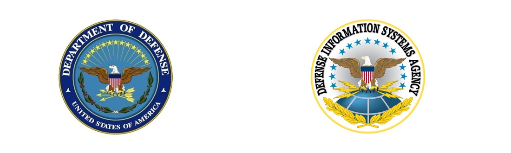
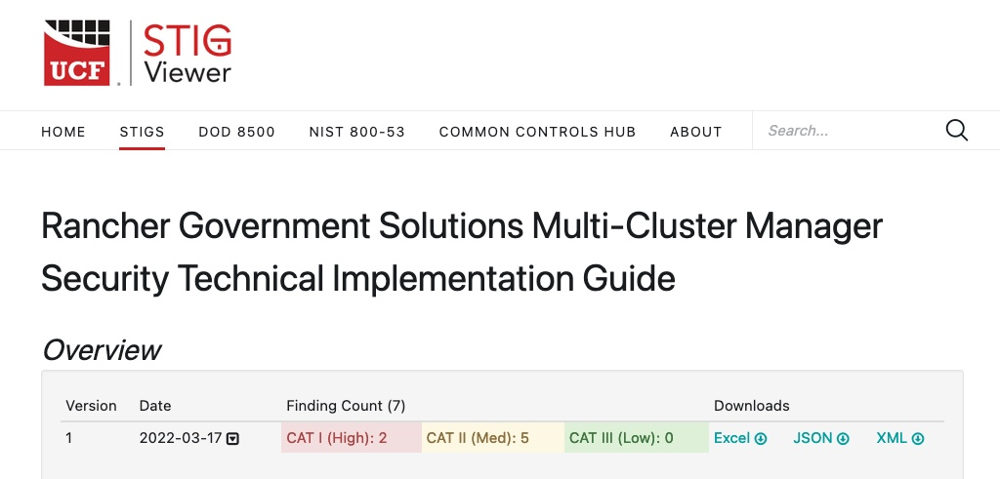

# Have you STIG'd your Kubernetes yet

## Don't let down the Engineers and Secure you Kubernetes

Welcome back. We hope you had a chance to read the first of this series [Creating a Secure Kubernetes Deployment](https://intelligencecommunitynews.com/ic-insiders-creating-a-secure-kubernetes-deployment-five-ways-the-new-nsa-kubernetes-hardening-guide-can-help/). In this article we are going a little deeper with Security Technical Implementation Guides (STIGs). We will try not to get too technical. But it is important to highlight some of the more important pieces.

---

> **Table of Contents**:
>
> * [What is a STIG?](#what-is-a-stig?)
>   * [Why is it important](#Why-are-STIGs-Important)
> * [How are they used in the IC](#How-are-all-Kubernetes-not-equal)
> * [Where to find STIGs](#Rancher---Secure-by-default)
> * [What other STIGs are out there](#Rancher---Secure-by-default)
> * [Rancher STIG](#Key-points-from-the-Guide)
>   * [How to apply the Rancher STIG](#Kubernetes-Pod-Policy)
> * [RKE2 STIG](#Key-points-from-the-Guide)
>   * [How to apply RKE STIG](#Kubernetes-Pod-Policy)
> * [What did we learn](#What-did-we-learn)

---
s
## What is a STIG?



Plainly put, STIG stands for Security Technical Implementation Guide.  It is a guide on how to configure a system or application to a security standard. The STIG is written in conjunction with the vendor and Defense Information Systems Agency (DISA). Once written it hs heavily reviewed by DISA without the vendors input. This is extremely important for validation purposes. More information about STIGs is available on at [public.cyber.mil/stigs/](https://public.cyber.mil/stigs/).

### Why are STIGs Important
WORK
The end result is a technical hardening guide that can be trusted. What is interesting is that Corporations are following the US Government in adopting the STIG as the hardening standard. Effectively creating a Secure Baseline for operating systems, frameworks, and applications. Applying the STIG dramatically decreases the guess work by the IT staff.

## How are they used in the IC
WORK
The Department of Defense (DOD) and the Intelligence Community (IC) have been used the STIGs for years as THE security base line for all systems. The DOD/IC has been pushing vendors to work with DISA to write and improve STIGs for all networks levels. An interesting fact is that we are seeing STIGs being applied to lower Impact Levels (IL), such as IL5 and IL4. Meaning the value of the STIGs has a very far reaching impact.

## Where to find STIGs

DISA maintains [public.cyber.mil/stigs/](https://public.cyber.mil/stigs/) as the source of truth for all STIGs. There is also [StigViewer](https://www.stigviewer.com/) for another view at the STIGs. DISA has a local Java view on their tools page [public.cyber.mil/stigs/srg-stig-tools/](https://public.cyber.mil/stigs/srg-stig-tools/). For the use of this guide lets take advantage of [StigViewer](https://www.stigviewer.com/). The STIG Viewer has a complete [collection of STIGS](https://www.stigviewer.com/stigs). It is worth a look.

## What other STIGs are out there

Currently the only other STIG related to Kubernetes is a [generic one](https://www.stigviewer.com/stig/kubernetes/). The generic STIG is a good reference. Although it lacks the specific details need to actually implement the guidance. Distribution specific guides are more valuable with concise information.

## Rancher STIG

Rancher is the first company to have a multi-cluster Kubernetes manager STIG release by DISA. This is a huge milestone in protecting their customers with a validated technical implementation guide. There is a nice article about it from [Businesswire](https://www.businesswire.com/news/home/20220425005143/en/DISA-Validates-Rancher-Government-Solutions%E2%80%99-Security-Technical-Implementation-Guide-for-the-Rancher-Multi-cluster-Manager-2.6-for-Kubernetes).

You can download the STIG itself from [https://dl.dod.cyber.mil/wp-content/uploads/stigs/zip/U_RGS_MCM_V1R1_STIG.zip](https://dl.dod.cyber.mil/wp-content/uploads/stigs/zip/U_RGS_MCM_V1R1_STIG.zip). Using the online [STIG Viewer - Rancher](https://www.stigviewer.com/stig/rancher_government_solutions_multi-cluster_manager/) we can see all the controls.



### How to apply the Rancher STIGs

Thanks to the hard work of the Rancher engineers there are only seven (7) controls for the Rancher STIG. Please understand that this is for the Multi-Cluster Manager layer of the stack. We will talk about the Kubernetes layer in the next major section. Since there are only 7 controls lets review them all.

#### V-252843 - Use an AUTH provider - Keycloak

This control states that an external authentication methods needs to be installed. A very popular is called KeyCloak. [Rancher had great docs](https://rancher.com/docs/rancher/v2.6/en/admin-settings/authentication/keycloak-oidc/) that show how to configure OpenID Connect (OIDC).

#### V-252844 - Audit Logging

This control is for ensure Audit Logging is enabled.

Fix Text: Ensure audit logging is enabled:

* Navigate to Triple Bar Symbol >> Explore Cluster >> local
* In the top Select ALL Namespaces from the drop down that currently says "Only User Namespaces".
* Click "deployments" under Workload menu item.
* Select "rancher" in the Deployments section under the 'cattle-system' namespace.
* Click the three dot config menu on the right.
* Choose "Edit Config".
* Scroll down to the "Environment Variables" section.
* Change the AUDIT_LEVEL value to "2" or "3" and then click "Save".

If the variable does not exist:

* Click "Add Variable".
* Keep Default key/Value Pair as "Type"
* Add "AUDIT_LEVEL" as Variable Name.
* Input "2,3" for a value.
* Click "Save".

Leveraging Helm is a great option for ensure everything is set. Simply add `-set auditLog.level=2 --set auditLog.destination=hostPath` to the Helm command or add the similar lines to the `values.yaml` file. Here is an example of the command.

```bash
helm upgrade -i rancher rancher-latest/rancher --create-namespace --namespace cattle-system --set hostname=rancher.$domain --set bootstrapPassword=bootStrapAllTheThings --set replicas=1 --set auditLog.level=2 --set auditLog.destination=hostPath
```

#### V-252845 - Role must be User

This control is about adopting a tighter default user role for Ranchers RBAC. Basically to scope in the default permissions.

Fix Text: From the GUI, navigate to Triple Bar Symbol >> Users & Authentication. In the left navigation menu, click "Roles".

* Click "Standard User".
* At the top right, click the three dots, and then "Edit Config".
* Under "New User Default", select "No" and click "Save".
* Click "User-Base".
* At the top right, click the three dots, and then click "Edit Config".
* Under "New User Default", select "Yes", and then click "Save".

#### V-252846 - Audit Record Storage

This control is for installing and using logging for maintaining application logs.

Fix Text: Enable log aggregation:
Navigate to Triple Bar Symbol.

For each cluster in  "EXPLORE CLUSTER":

* Select "Cluster".
* Select "Cluster Tools" (bottom left).
* In the "Logging Block", select "Install".
* Select the newest version of logging in the dropdown. 
* Open the "Install into Project Dropdown".
* Select the Project. (Note: Kubernetes STIG requires creating new project & namespace for deployments. Using Default or System is not best practice.)
* Click "Next".
* Review the options and click "Install".

#### V-252847 - Never automatically remove or disable emergency accounts

This control ensures that the local administrator emergency account is still active.

Fix Text: Ensure local emergency admin account has not been removed and is the only Local account.

Navigate to the Triple Bar Symbol >> Users & Authentication. In the left navigation menu, click "Users".
To Create a User:

* Click "Create".
* Complete the "Add User" form. Ensure Global Permissions are set to "Administrator".
* Click "Create".

To Delete a User:

* Select the user and click "Delete".

#### V-252848 - Enforce organization-defined circumstances and/or usage conditions for organization-defined accounts.

This control should be simple. Please ensure that you are a enterprise signed certificate.

Fix Text: Update the secrets to contain valid certificates.

Put the correct and valid DOD certificate and key in files called "tls.crt" and "tls.key", respectively, and then run:
`kubectl -n cattle-system create secret tls tls-rancher-ingress  --cert=tls.crt   --key=tls.key`

Upload the CA required for the certs by creating another file called "cacerts.pem" and running:
`kubectl -n cattle-system create secret generic tls-ca \   --from-file=cacerts.pem=./cacerts.pem`

The helm chart values need to be updated to include the check section:
privateCA: true
ingress:
tls:
ce: secret

Re-run helm upgrade with the new values for the certs to take effect.

#### V-252849 - Prohibit or restrict the use of protocols

This control is for limiting the ports that are allowed for ingress to the Rancher UI/API.

Fix Text: Navigate to Triple Bar Symbol >> Explore Cluster >> local
From the kubectl shell (>_) execute the following:

```bash
kubectl patch -n cattle-system service rancher -p '{"spec":{"ports":[{"port":443,"targetPort":443}]}}'

# change the hostname to match your ingress URL.
export RANCHER_HOSTNAME=rancher.rfed.io

kubectl -n cattle-system patch ingress rancher -p "{\"metadata\":{\"annotations\":{\"nginx.ingress.Kubernetes.io/backend-protocol\":\"HTTPS\"}},\"spec\":{\"rules\":[{\"host\":\"$RANCHER_HOSTNAME\",\"http\":{\"paths\":[{\"backend\":{\"service\":{\"name\":\"rancher\",\"port\":{\"number\":443}}},\"pathType\":\"ImplementationSpecific\"}]}}]}}"

kubectl patch -n cattle-system service rancher --type=json -p '[{"op":"remove","path":"/spec/ports/0"}]'
```

## RKE2 STIG

### How to apply RKE STIG

## What did we learn
